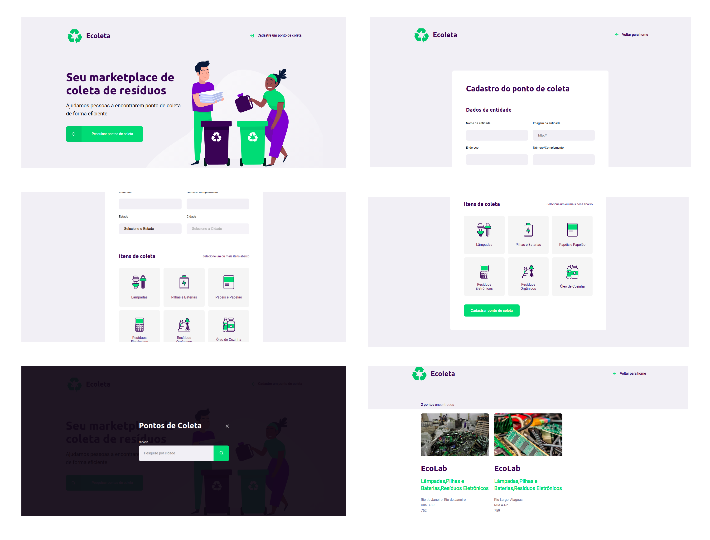

<h1 align="center">
    
</h1>

## 🚀 Tecnologias

- [Express](https://expressjs.com/pt-br/)
- [Node.js](https://nodejs.org/en/)
- [Nunjucks](https://mozilla.github.io/nunjucks/)
- [SQLite](https://www.sqlite.org/index.html)

## 💻 Projeto

O Ecoleta ajuda as pessoas e empresas a encontrar o ponto de coleta de resíduos para dispor adequadamente. 

## 🔖 Layout

